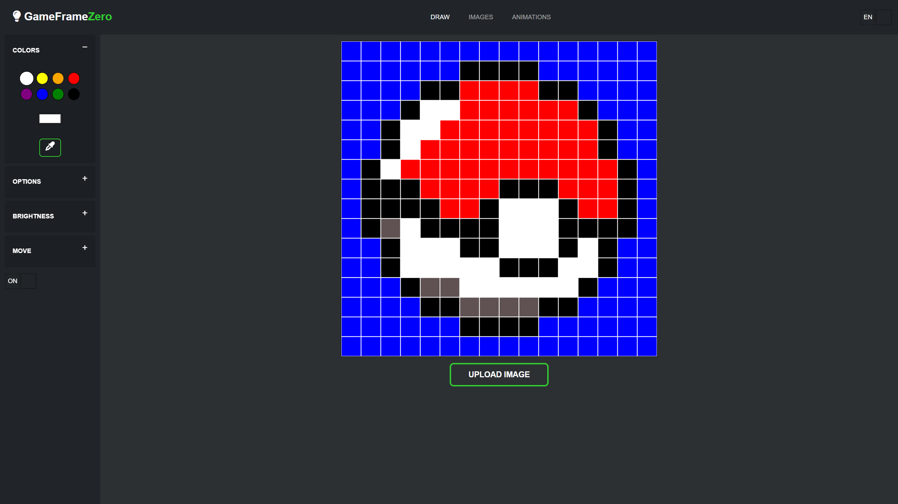

# GameFrameZero

This project is a DIY LED frame that displays 16x16 pixel art.
It's my attempt to make a comparable DIY device to all the other pixelframes that are available on the market.
The Project is built around a Raspberry Pi Zero WH, running a web server for creating, storing and animating the pixel images.

Depending on whether you have small electronic components such as switches and DC sockets lying around, the project can be replicated for around 50 euros.





## Preparation

Prepare the Raspberry Pi Zero WH by following these steps:
````
1. Install "Raspberry Pi OS Lite (32-bit) on your SD-Card using the Raspberry Pi Imager.
2. Activate SSH by creating a empty file with the name "ssh" in the boot partition on the SD-Card.
3. Configure WLAN by creating a file with the name "wpa_supplicant.conf" with the following content:
country=DE
ctrl_interface=DIR=/var/run/wpa_supplicant GROUP=netdev
update_config=1
network={
    ssid="WLAN-Name"
    psk="Passwort"
    key_mgmt=WPA-PSK
}
4. Open the config by running "sudo raspi-config".
4.1. In the "System Options", change Password and Hostname.
4.2. In the "Performance Options", set the GPU Memory to 32 MB.
4.3. In the "Advanced Options", expand the filesystem.
5. Run "sudo apt update".
6. Run "sudo apt upgrade".
7. Run "sudo rpi-update".
8. Run "sudo reboot".
````

## Installation

Clone Repository
````
git clone https://github.com/Kurzhalsgiraffe/GameFrameZero
````
Make sure to install the needed libraries with sudo permissions, to run the Web-Server as root
````
sudo apt install python3-pip
sudo apt install python3-opencv
sudo pip3 install flask
sudo pip3 install rpi-ws281x
sudo pip3 install waitress
````
After installing the libraries, check if they are installed correctly by running python on the raspberry pi,
importing the libraries and checking the versions:
````
>>> import cv2
>>> import flask
>>> import numpy
>>> import rpi_ws281x

>>> cv2.__version__
'4.5.1'
>>> flask.__version__
'2.2.2'
>>> numpy.__version__
'1.19.5'
>>> rpi-ws281x.__version__
'4.3.4'
````

## Setup the Autostart

Create service file
````
cd /etc/systemd/system
sudo nano gameframezero.service
````
Paste
````
[Unit]
Description=GameFrameZero Autostart

[Service]
User=root
WorkingDirectory=/home/pi/GameFrameZero/
ExecStart=python3 -O server.py
Restart=always

[Install]
WantedBy=multi-user.target
````
Start the service
````
sudo systemctl start gameframezero.service
sudo systemctl enable gameframezero.service
````

## Setup the GPIO-Shutdown

If you want to shutdown the Raspberry-Pi by pressing a button, you need to enable gpio-shutdown
````
sudo nano /boot/config.txt
````
Paste
````
dtoverlay=gpio-shutdown, gpio_pin=3, active_low=1, gpio_pull=up
````

### Material i used

- Raspberry Pi Zero WH
- 16x16 256 Pixel 5V LED Matrix, WS2812B (Individually Addressable)
- Shadow Box Frame (20cm x 20cm) as the frame case
- DC 5V 3A Power Adapter (Current heavily depends on the brightness of your LED Matrix)
- DC Socket
- Button for Shutting down the PI via GPIO
- Powerswitch
- PCB for soldering
- PCB terminal block
- PCB socket strips
- 3D printed case and grid


## Assembly

Solder all the components together, using PCB terminal blocks to screw in the cables is a good practice.
Since the LED Matrix and the Raspberry both run on 5V, you can use the same powerline for both.
The shutdown button is optional.
GPIO 18 Pin goes to the data pin of the LED Matrix.
I soldered some PCB socket strips to the PCB, to plug the Raspberry Pi directly onto the PCB.

The grid fits perfectly to my Shadow Box Frame. If yours does not fit, can adjust the inventor file.


### Disclaimer

Please note that this is just a hobby project. Code or hardware may not reflect best practice.
Feel free to send me a pull request! :)
