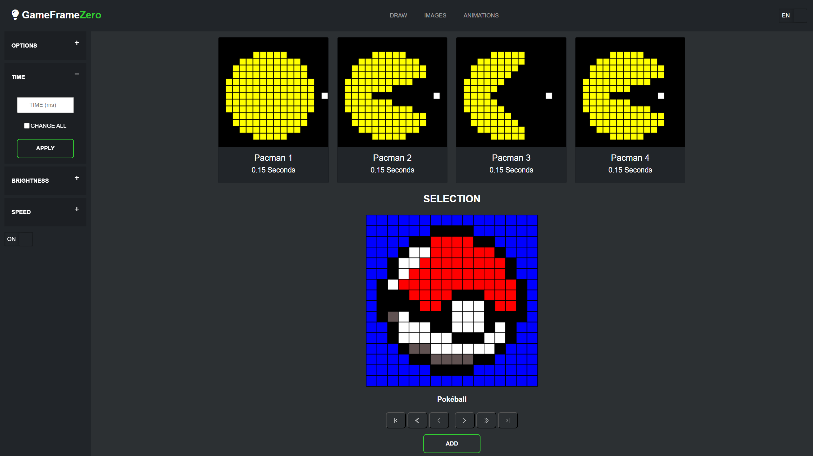

# GameFrameZero

This project is a DIY LED frame that displays 16x16 pixel art.
It's my attempt to make a comparable DIY device to all the other pixelframes that are available on the market.
It is a Raspberry Pi Zero WH running a web server for creating, storing and animating the pixel art.

Depending on whether you have small electronic components such as switches and DC sockets lying around, the project can be replicated for around 50 euros




## Installation

Clone Repository
````
git clone https://github.com/Kurzhalsgiraffe/GameFrameZero
````

Make sure to install it with sudo, if you want to run the Server as root
````
sudo apt install python3-pip
sudo pip3 install flask
sudo pip3 install rpi-ws281x
sudo pip3 install waitress
````

## Setup the Autostart

Create service file
````
cd /etc/systemd/system
sudo nano gameframezero.service
````
Paste
````
[Unit]
Description=GameFrameZero Autostart

[Service]
User=root
WorkingDirectory=/home/pi/GameFrameZero/
ExecStart=python3 server.py
Restart=always

[Install]
WantedBy=multi-user.target
````
Start the service
````
sudo systemctl start gameframezero.service
sudo systemctl enable gameframezero.service
````

## Setup the GPIO-Shutdown

If you want to shutdown the Raspberry-Pi without an SSH connection, you need to enable gpio-shutdown
````
sudo nano /boot/config.txt
````
Paste
````
dtoverlay=gpio-shutdown, gpio_pin=3, active_low=1, gpio_pull=up
````

### Material i used

- Raspberry Pi Zero WH
- 16x16 256 Pixel LED Matrix, WS2812B (Individually Addressable)
- Shadow Box Frame (20cm x 20cm) as the Frame case
- DC 5V >3A Power Adapter (Depends on the Brightness of your LED Matrix, i set it on btightness=50)
- DC Socket
- Button for Shutting down the PI via GPIO
- Powerswitch
- PCB for soldering
- Block screw clamps
- PCB Socket Strips
- Solder
- Some Cables
